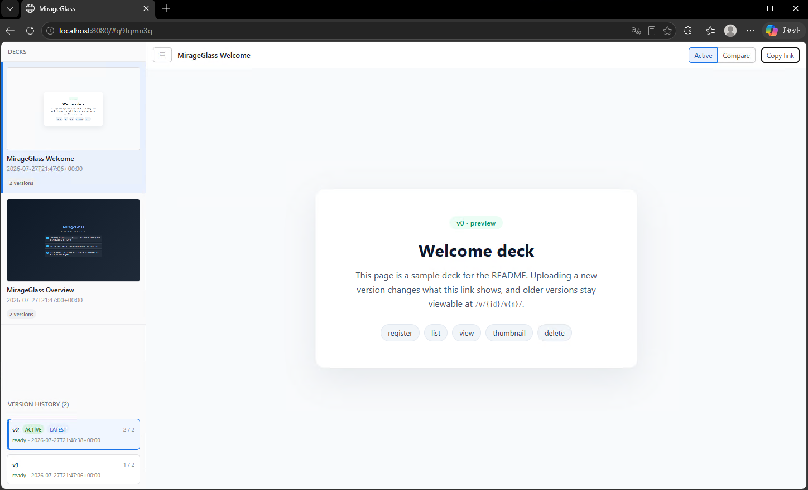

# MirageGlass

MirageGlass is a self-hosted viewer and version manager for HTML presentation decks. Each upload is a ZIP archive with a single `index.html` at its root. A deck keeps one stable viewer URL while new uploads build its version history.



## What it provides

- Registration and version uploads through a token-protected API
- Stable active-viewer links and version-specific viewer links
- Downloadable deck archives and file manifests
- Automatic thumbnails, with registration remaining available if capture fails
- A browser dashboard for browsing versions and comparing two versions side by side
- Idempotency keys for safe registration and upload retries

## Quick start

```bash
pip install -r requirements.txt
python -m playwright install chromium
cp .env.example .env
# Set MIRAGEGLASS_TOKEN in .env.
uvicorn server.main:app --port 8100
```

MirageGlass creates `storage/` on first start and applies database migrations automatically through `auto_migration: true`.

`server/config.py` loads `.env` with `load_dotenv()`. Variables already exported in the environment take precedence because dotenv loading uses `override=False`.

## Looking up the usage guide

```text
GET /api/v1/help
```

This unauthenticated endpoint returns the available endpoints, recommended workflow, and common gotchas as JSON. Use `/docs` for the OpenAPI schema and `/api/v1/help` for task-oriented instructions.

## Registering a deck

Multipart fields **must be sent as UTF-8**. For automation, use `requests` so behavior does not depend on the console code page.

```python
import requests

r = requests.post(
    "http://127.0.0.1:8100/api/v1/decks",
    headers={"Authorization": f"Bearer {token}"},
    files={"file": ("deck.zip", open("deck.zip", "rb"), "application/zip")},
    data={"name": "Main landing deck", "idempotency_key": "build-2026-07-22-01"},
)
r.raise_for_status()
print(r.status_code, r.json()["id"])
```

A new registration returns `201`. Reusing the same `idempotency_key` returns the existing deck with `200` instead of creating a duplicate. If the earlier attempt ended with `failed`, MirageGlass cleans up its leftovers and processes the upload again under the same key.

For manual checks with curl, keep the name ASCII-only unless the console is confirmed to use UTF-8:

```bash
curl -X POST http://127.0.0.1:8100/api/v1/decks \
  -H "Authorization: Bearer $MIRAGEGLASS_TOKEN" \
  -F "file=@deck.zip" \
  -F "name=landing-draft" \
  -F "idempotency_key=build-2026-07-22-01"
```

Common response codes are `201` for a new deck, `200` for an idempotent replay, `400` for invalid input or a rejected archive, `401` for a missing or invalid token, `404` for a missing resource, and `500` for a processing failure.

## Editing and versioning a deck

Download a ready version, edit the extracted files, rebuild the ZIP with `index.html` at its root, and upload it as a new version of the same deck. Downloads and file manifests are read operations and do not require authentication.

```bash
curl -o deck.zip "http://127.0.0.1:8100/api/v1/decks/$DECK_ID/download?version=1"
curl "http://127.0.0.1:8100/api/v1/decks/$DECK_ID/files?version=1"
curl -X POST "http://127.0.0.1:8100/api/v1/decks/$DECK_ID/versions" \
  -H "Authorization: Bearer $MIRAGEGLASS_TOKEN" \
  -F "file=@deck.zip" \
  -F "idempotency_key=build-2026-07-22-02"
```

The downloaded archive is rebuilt from `storage/decks/{id}/versions/{n}/src`; it is not a byte-for-byte copy of the original upload. Its layout is ready for immediate re-upload. Version-specific content is available at `/v/{id}/v{n}/`, while the stable active link continues to point at the selected deck version.

## Project layout

```text
server/
  main.py            FastAPI application and lifespan setup
  config.py          Environment settings and database initialization
  api.py             Deck, version, viewer, download, manifest, and help routes
  repository.py      Database access through sqloader
  storage.py         ZIP validation, extraction, and path resolution
  thumbnail.py       Playwright thumbnail capture
  sql/
    queries/queries.json
    migrations/sqlite/
web/index.html       Deck dashboard and side-by-side comparison UI
assets/images/       Documentation images
requirements.txt     Runtime dependencies
.env.example         Configuration template
```

## Storage layout

```text
storage/
  mirageglass.db
  decks/{id}/versions/{n}/src/index.html
  decks/{id}/versions/{n}/thumb.png
  tmp/
```

## Operational notes

- The sqloader configuration key is spelled `sqloder`, matching the library.
- The package and import name is `sqloader`; its upstream repository is `py_sqloader`.
- Use an isolated virtual environment and install the versions in `requirements.txt`. The older `sqloader` 0.2.15 release has an incompatible `sqloader.init` import.
- `/v/{id}` and `/v/{id}/v{n}` redirect with `307` to their trailing-slash forms. The trailing slash is required for relative deck assets to resolve correctly.
- On consoles using cp932, cp949, or another non-UTF-8 code page, `curl.exe -F` can corrupt non-ASCII deck names. This is a client encoding issue; automated registration should send UTF-8 multipart fields.